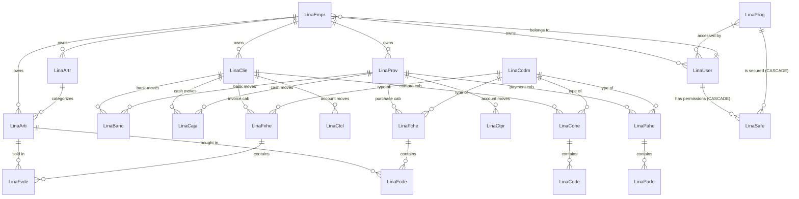

# Diagrama Entidad-Relación (EER) - Sistema LinaWeb

Este diagrama representa las relaciones entre las 24 tablas del sistema.

## Lógica de Base de Datos

### Auditoría Automática
El sistema cuenta con un robusto sistema de auditoría implementado mediante disparadores (**triggers**) en 21 tablas del sistema.

*   **Campos Auditados**: `user`, `date`, `time`, `oper`, `prog`, `wstn`, `nume`.
*   **Formato de Hora**: `hh:mm:ss`.
*   **Operaciones**:
    *   `I`: Registro insertado.
    *   `U`: Registro actualizado.
*   **Integración con la Web**: La aplicación envía el usuario logueado y el código del programa activo a través de variables de sesión de MySQL (`@lina_user` y `@lina_prog`), permitiendo que la base de datos identifique quién realizó cada cambio incluso desde la capa web.

### Sincronización de Permisos (Security)
La tabla `linasafe` (Permisos) se mantiene sincronizada automáticamente con las tablas `linauser` (Usuarios) y `linaprog` (Programas).

*   **Procedimiento Almacenado**: `sp_sync_linasafe` se encarga de ecualizar las tablas para asegurar que cada usuario tenga una entrada de permiso para cada programa del sistema.
*   **Automatización**: Se ejecutan disparadores automáticos ante cualquier `INSERT` o `DELETE` en las tablas de Usuarios o Programas.
*   **Integridad Referencial**: 
    *   **ON UPDATE CASCADE**: Cambios en códigos de usuario o programa se propagan automáticamente a los permisos.
    *   **ON DELETE CASCADE**: La eliminación de usuarios o programas limpia automáticamente sus permisos asociados.

